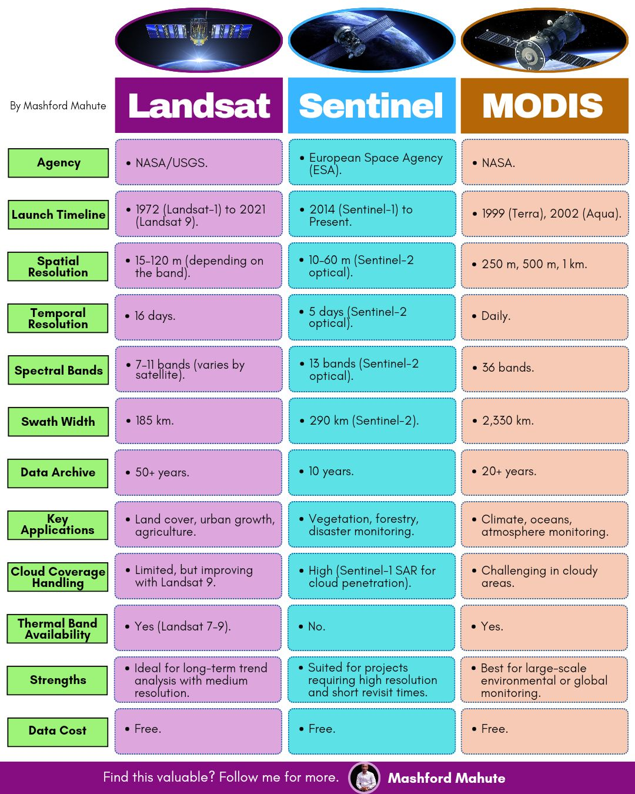

# Land Use Change Detection Project

Land use change detection and monitoring system in Córdoba, Argentina, using satellite imagery.

## System Requirements

### Software Versions
- Python 3.11.8

### Development Environment Setup

### 1. Clone the repository:
```bash
git clone https://github.com/OmdenaAI/CordobaArgentinaChapter_MonitoringLandUseTransformation.git
```

### 2. Navigate to project directory:
```bash
cd CordobaArgentinaChapter_MonitoringLandUseTransformation
```

### 3. Install Python 3.11.8:

#### For MacOS (using pyenv):
```bash
# Install pyenv if you haven't already
brew install pyenv

# Install Python 3.11.8
pyenv install 3.11.8

# Set Python 3.11.8 as local version for this project
pyenv local 3.11.8

# Reload shell configuration
source ~/.zshrc    # If using zsh
# OR
source ~/.bashrc   # If using bash

# Verify installation
python --version  # Should show Python 3.11.8
```

#### For Windows:
Download and install Python 3.11.8 from the official website:
https://www.python.org/downloads/release/python-3118/

### 4. Set up Python virtual environment:

```bash
# Create virtual environment
python -m venv venv

# Activate virtual environment
source venv/bin/activate  # Linux/Mac
# OR
.\venv\Scripts\activate  # Windows

# Install dependencies
pip install -r requirements.txt
```

### 5. Set up Frontend:

```bash
# Navigate to frontend directory
cd frontend

# Install Node.js dependencies
npm install

# Start development server
npm run dev
```

The frontend will be available at `http://localhost:5173`

## Project Structure

```
change_detection_project/
├── preprocessing_service/ # Image preprocessing service
├── model_service/        # Model inference service
├── api_gateway/          # API Gateway (FastAPI)
├── queue_service/        # Queue service (Redis + Celery)
├── frontend/            # Frontend (React)
└── common/              # Shared code between services
```

## Git Workflow

1. Create branch from develop:
```bash
git checkout develop
git pull origin develop
git checkout -b feature/feature_name
```

2. Commit changes:
```bash
git add .
git commit -m "feat: description of change"
git push origin feature/feature_name
```
Create PR in GitHub from feature -> develop

## Additional Documentation

- [Development Guide](./docs/development.md)
- [API Documentation](./api-gateway/README.md)
- [Deployment Guide](./docs/deployment.md)

## Contact

For questions or suggestions, contact:
- Tech Lead: [Name](mailto:email@example.com)
- Project Manager: [Name](mailto:email@example.com)

## Available Satellites



## Satellite Data Sources

The project can work with imagery from the following satellites:

| Satellite | Resolution | Revisit Time | Bands | Best Use Case |
|-----------|------------|--------------|--------|---------------|
| Sentinel-2 | 10m, 20m, 60m | 5 days | 13 bands | Land use, agriculture, forest monitoring |
| Landsat 8-9 | 15m, 30m, 100m | 16 days | 11 bands | Historical analysis, long-term changes |
| MODIS | 250m, 500m, 1km | Daily | 36 bands | Large-scale monitoring, rapid changes |
| Planet | 3-5m | Daily | 4 bands | High-resolution monitoring (commercial) |

## System Architecture

Initial proposal for the system architecture:

