<h1 style="color: #7A8B56; font-size: 24px; font-weight: bold; text-align: center; padding: 10px; border: 2px solid #7A8B56;">Queue Service</h1>

## Overview

```mermaid
%%{
  init: {
    'theme': 'base',
    'themeVariables': {
      'primaryColor': '#7A8B56',
      'primaryTextColor': '#FFFFFF',
      'primaryBorderColor': '#5C6B3B',
      'lineColor': '#9A9F68',
      'secondaryColor': '#6E4B3A',
      'tertiaryColor': '#D1C6B1'
    }
  }
}%%

graph TB;

    subgraph Network[Queue Service Network]
        Redis
        CeleryWorkers
        Flower
        FastAPI
        MiniO
    end
    
    subgraph CeleryWorkers[Celery Workers]
        Worker1["👷 Celery Worker"]
        WorkerN["👷 Celery Worker"]
    end

    subgraph Flower[Flower]
      FlowerUI["🌸 FlowerUI"]
    end

    subgraph Redis[Redis Instance]
        RedisBroker@{ shape: cyl, label: "🛢️ Tasks Broker - DB 0" }
        RedisBackend@{ shape: cyl, label: "🛢️ Tasks Results - DB 1" }
    end

    subgraph FastAPI[FastAPI Instance]
        API["🌍 FastAPI App"]
    end

    subgraph MiniO[MiniO Instance]
      QueueBucket["🧺 Queue Bucket"]
    end

    CeleryWorkers --->|Stores Results In| RedisBackend
    CeleryWorkers --->|Monitors Data from| Flower
    RedisBackend --->|Fetches Results From | FastAPI
    CeleryWorkers <--->|Open/Saves files| MiniO
    FastAPI <--->|Open/Saves files| MiniO
    FastAPI --->|Publishes to| RedisBroker 
    RedisBroker --->|Fetches Tasks From| CeleryWorkers  


```



## General File Structure

<details>
  <summary>Click here to expand the application's file structure graphic</summary>

```
Queue-Service
+---celery
|   +---app
|   |   __init__.py
|   |   celery_app.py
|   |   tasks.py
|   |   requirements.txt
|   |
|   .env
|   Dockerfile
|   README.md
|
+---docker
|   README.md
|
+---fast-api
|   +---app
|   |   __init__.py
|   |   celery_config.py
|   |   main.py
|   |   requirements.txt
|   |
|   .env
|   Dockerfile
|   README.md
|
+---redis
|   .env
|   docker-compose.yaml
|   redis.conf
|   README.md
|
+---virtual-machine
|   +---src
|   |   appliance-import-1.jpg
|   |   appliance-import-2.jpg
|   |   appliance-import-3.jpg
|   |   appliance-import-4.jpg
|   |   appliance-import-5.jpg
|   |   appliance-import-6.jpg
|   |   appliance-import-7.jpg
|   |   appliance-import-8.jpg
|   |   appliance-import-9.jpg
|   |   appliance-import-10.jpg
|   |
|   README.md
|
|---README.md
```

</details>

## Setup

### Environment Details
- **Demo**: The demo runs on a Virtual Machine using **Ubuntu 24.04**. If you want to run the machine in your own environment, you can check the Virtual Machine Tutorial [here](queue_service\virtual-machine\README.md)

- **Docker 27.5.1** (build 9f9e405) and **Docker Compose 2.32.4** were installed on the Virtual Machine. Please note, earlier Docker versions are not available on Ubuntu 24.04. For installation details, refer to [this guide](docker/README.md).
  
- **Resource Allocation**: The machine has been provisioned with resources similar to a **t4g.micro** AWS EC2 instance.

<table align="center">
  <thead>
    <tr>
      <th>Operating System</th>
      <th>Base Memory</th>
      <th>Processors</th>
      <th>Storage</th>
     </tr>
  </thead>
  <tbody>
    <tr>
      <td>Ubuntu 24.04 64-bits</td>
      <td>1024Mb</td>
      <td>2</td>
      <td>10Gb</td>
    </tr>
  </tbody>
</table>

### Service Setup
The service is orchestrated using **Docker Compose** and is driven by a single `docker-compose.yaml` file located in the [redis](redis) directory. Before running the compose file, you need to setup a custom Docker network for the service.

```bash
docker network create queue-network
```

### Deployment
- **Redis**: Deployed using a pre-built image from Docker Hub.
- **MiniO**: Simulating AWS S3 instance. Deployed from pre-built image from Docker Hub.
- **Flower**: Also deployed from pre-built image pulled from Docker Hub, with custom settings provided via docker-compose.
- **Celery & FastAPI**: Both services use custom Docker images, which are built using the `Dockerfile` and environment variables found in their respective directories. 
- The `docker-compose.yaml` and `.env` files in the **Redis** directory links everything together and ensures smooth orchestration.

