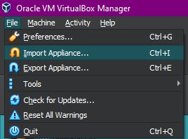
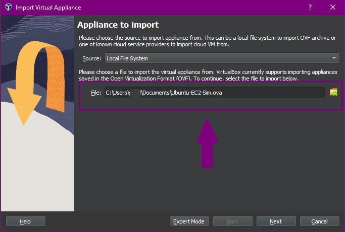
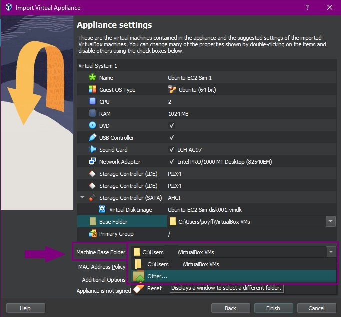
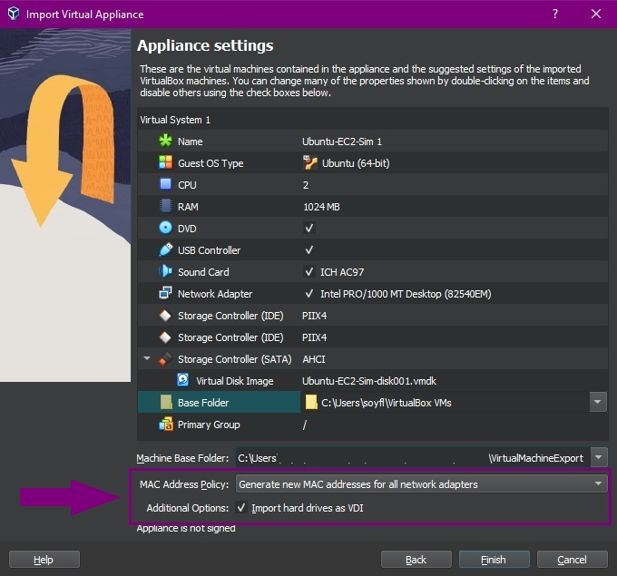
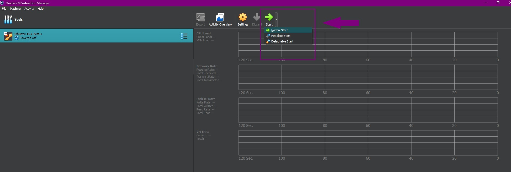
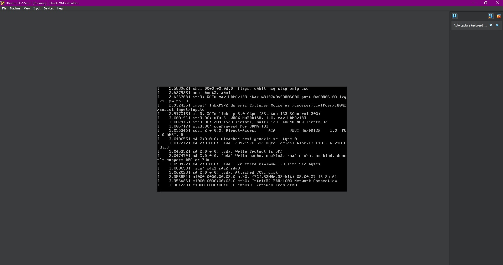
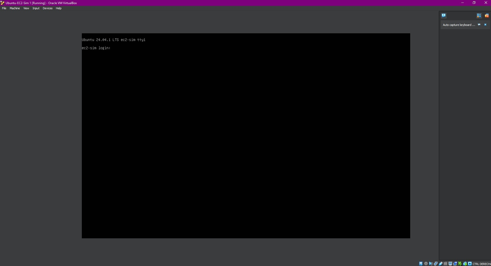
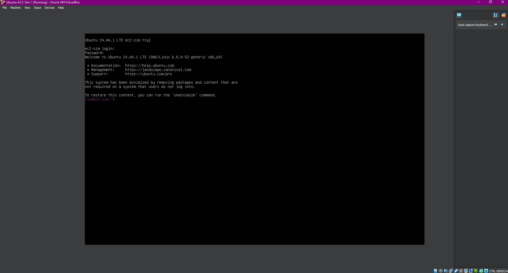
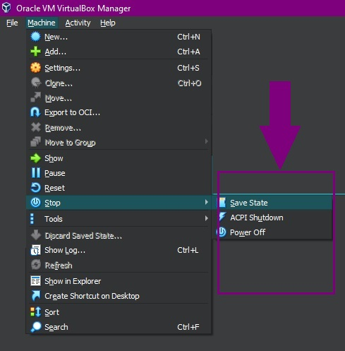
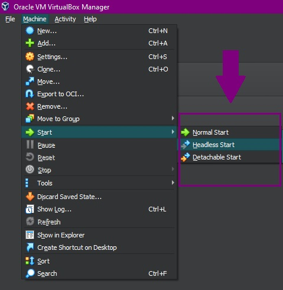

# Virtual Machine Setup

## Requirements

* `Oracle VM VirtualBox Manager`, version 7.0 was used for this example. You can check downloads for your OS [`here`](https://www.virtualbox.org/wiki/Downloads).
* 10Gb+ of free disk space on the local machine you'll be using.

## How to mount a Virtual Machine in .ova format

1) Once VirtualBox is installed in your system, download and decompress the .rar file sent over Slack. You can find it pinned to the backend-and-api channel, together with a credentials file. The password in there needs to be used for the .rar. 
2) Start VirtualBox, go to `File` → `Import Appliance`.<br><br><p align='center'></p>
3) Select the `Ubuntu-EC2-Sim.ova`from the location you saved it to, and click `Next`. <br><br><p align='center'></p>
4) I recommend you change the Machine Base Folder to one you can relate to the project <br><br><p align='center'></p>
5) Same for the base folder where the machine is actually going to be saved once built, recommended you create/pic a directory you can easily relate to the project. <br><br><p align='center'></p>
6) The rest of the settings should work nicely as a starting point. Press `Finish`and continue to VirtualBox main menu.
7) You should see the machine added now. Go to start, and this first time, pick the `Normal Start`<br><br><p align='center'></p>
8) As the Machine was powered off, this first normal start will take a while and will show the startup operations in the terminal, so you'll have to wait.<br><br><p align='center'></p>
9) Once all is loaded and ready, you'll be prompted credentials, look for those at the Slack Channel, too.<br><br><p align='center'></p>
10) Now the terminal is ready for you to work on the machine! <br><br><p align='center'></p>
11) In my case, I prefer to use an SSH client of my choice called [`Bitvise SSH Client`](https://bitvise.com/download-area), you can download that one too. I find it useful as it comes with a copy paste config I find comfortable, and also has SFTP integrated, which you'll need to transfer files into the machine (not the only method, but by far the most comfortable one).
12) If you choose to use an SSH client, then make sure after this startup you `stop` the virtual machine with the `save` option.<br><br><p align='center'></p><br><br>That will let you pick headless start the next time, and use you client of choice comfortably.<br><br><p align='center'></p>

## Running the services.

* In order to be exported, the VM had to be powered off, which means the services are not running. To get those running again, you need to use the compose file:

```bash
flo@ec2-sim:~/queue-service/redis$ sudo docker-compose up --build -d
```

* Notice the docker-compose commands need to run from the directory the file is at, if you are not providing a reference to the durectory.

* If you want or need to stop the services (E.G. because you need to rebuild)

```bash
flo@ec2-sim:~/queue-service/redis$ sudo docker-compose stop
```

Again, from the directory where the `docker-compose.yaml` file is.


* To check the running containers
```bash
flo@ec2-sim:~/queue-service/redis$ sudo docker ps
```

## Modifying the services.

You can use the machine as a development enviroment, of course. If you want to test new code, granted no new installs are needed, you can replace the code with new ones, stop the services and re-start/re-deploy as show in the previous step. To transfer files into the VM, you'll need an FTP client, such as [`File-Zilla`](https://filezilla-project.org/download.php?type=client) or [`WinSCP`](https://winscp.net/eng/download.php). Notice that [`Bitvise SSH Client`](https://bitvise.com/download-area) has a built in SFTP client that you can use too.
