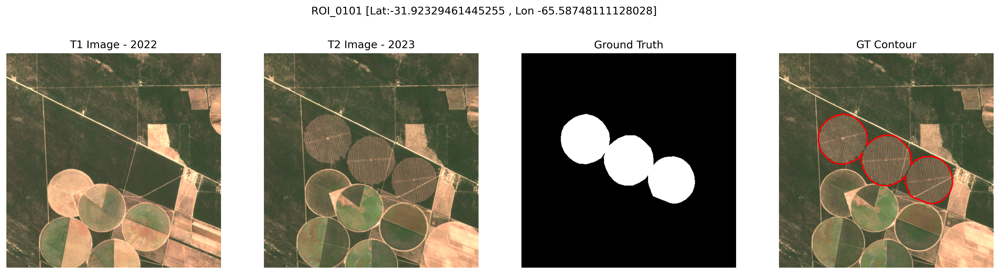
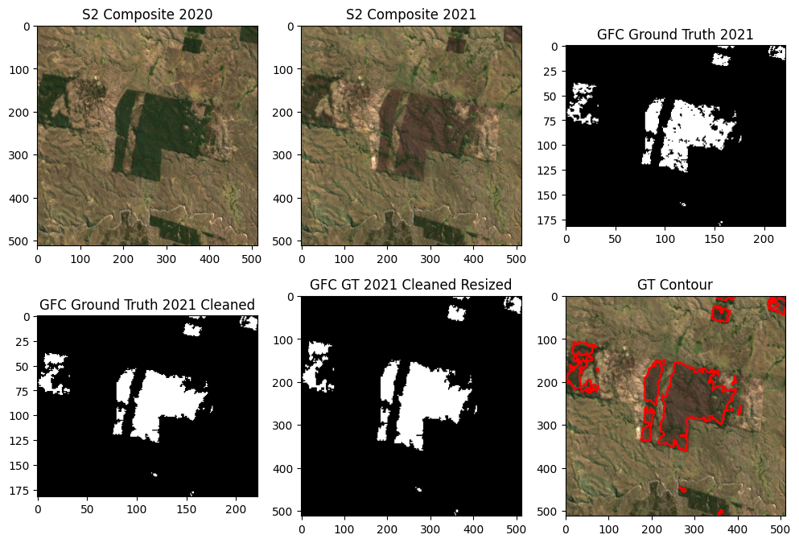
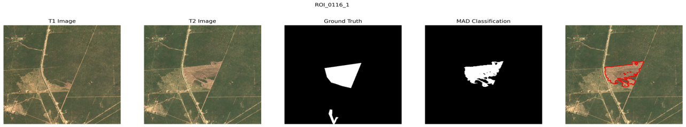

## Experimentation with the Test Data and Unsupervised Techniques

To use this code, you need to install the following libraries include in the requirements.txt file

```bash
conda create -n omdena python=3.11
conda activate omdena
pip install -r requirements.txt
```
If doesn't work, here is the list of the libraries:
- numpy==1.26.4
- pandas==2.2.3
- geopandas==1.0.1
- rasterio==1.4.3
- matplotlib==3.10.0
- ee==1.4.4
- scikit-learn==1.6.1
- shapely==2.0.6
- pyproj==3.7.0
- scikit-image==0.25.0
- python-dotenv==1.0.1

Only for GFCTestData.ipynb: 
- torch=2.5.1+cu124


## DesmonteTestData.ipynb
This notebook is used to generate the test data using the data from [Monitoreo Desmonte](https://drive.google.com/drive/folders/1rSE1yBCqIWxv1zQBOewYi3a48xQdviBM?usp=drive_link).

The final data is stored in this [Drive Folder](https://drive.google.com/drive/folders/1kG4vhhz-Y1rAdWEfSP-EM0LWNGWiuXkT?usp=drive_link)

The steps to generate the data are the following:
1. Generation of ROIs around the vectors of each shapefile from Monitoreo Desmonte: 167 ROIs with 5120 x 5120 meters or 512 x 512 Sentinel-2 pixels.
2. Download of the Sentinel-2 image composite from all the ROIs (t1 equals to past year and t2 equals to the current year of the shapefile). The bands used are B2, B3, B4, B5, B6, B7, B8, B8A, B11, and B12.
3. Manual revision of the ROIs to discard the ones that are not corresponds to the ground truth (vectors of the shapefile).
4. The final test dataset is divided in three parts: gt (ground truth), t1 (past year), and t2 (current year).



## GFCTestData.ipynb
This notebook is planned to generate the test data using the data from [Global Forest Change](https://earthenginepartners.appspot.com/science-2013-global-forest/download_v1.7.html). Actually, the notebook is not finished.



## UnsupervisedTechniques.ipynb
This notebook is used to apply unsupervised techniques to the test data generated in the DesmonteTestData.ipynb notebook. The techniques used are the following:
1. MAD (Multivariate Alteration Detection) algorithm, based on the following [GEE tutorial](https://developers.google.com/earth-engine/tutorials/community/imad-tutorial-pt1).
2. KMeans algorithm, using two clusters to separate the ROIs in two classes: deforestation and no deforestation (theorically).





## utils.py
This file contains the functions used in the DesmonteTestData.ipynb and UnsupervisedTechniques.ipynb notebooks.

- download_composite: Download the Sentinel-2 cloud-free composite from Google Earth Engine API. The statistic used to reduce the image collection is the median.

- sentinel_l2a_to_rgb: Convert the Sentinel-2 image composite to RGB image. Usefull to ML models that can only use RGB images as input.

- gt_to_0_255: Convert the ground truth image to 0-255 values. Also, usefull to ML models that can only use RGB images as input and the ground truth is a binary image (0 - no deforestation, 255 - deforestation).


