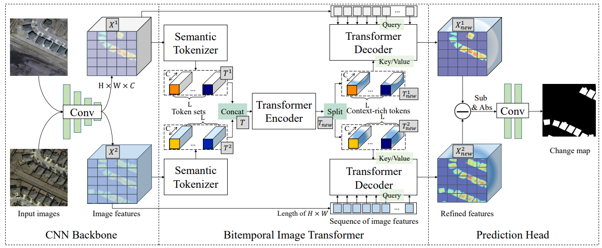
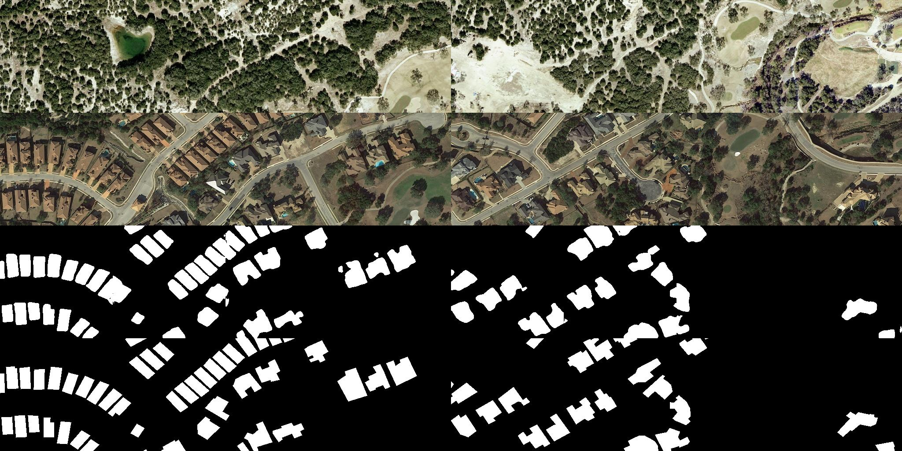

# Remote Sensing Image Change Detection with Transformers (Python 3.11.8 Update)

This is an updated version of the original [BIT_CD repository](https://github.com/justchenhao/BIT_CD) modified to work with Python 3.11.8. The original implementation provides the PyTorch implementation of the paper: Remote Sensing Image Change Detection with Transformers.

For more information about the original work, please see the published paper at [IEEE TGRS](https://ieeexplore.ieee.org/document/9491802) or [arxiv](https://arxiv.org/abs/2103.00208). 




Only tested for evaluation so far.


## Changes from Original Repository

This fork maintains the same functionality as the original repository but updates the dependencies to work with Python 3.11.8. The main changes are:

- Updated Python version from 3.6 to 3.11.8
- Updated PyTorch and torchvision to compatible versions
- Added support for Mac Silicon through MPS (some still pending)
- Updated other dependencies to their latest compatible versions

## Installation

1. Clone this repo:

2. Create and activate a conda environment:
```shell
conda create -n env python=3.11.8
conda activate env
```

3. Install dependencies:
```shell
pip install -r requirements.txt
```

## Quick Start

We have some samples from the [LEVIR-CD](https://justchenhao.github.io/LEVIR/) dataset in the folder `samples` for a quick start.

Firstly, you can download our BIT pretrained model——by [baidu drive, code: 2lyz](https://pan.baidu.com/s/1HiXwpspl6odYQKda6pMuZQ) or [google drive](https://drive.google.com/file/d/1IVdF5a3e1_7DiSndtMkhpZuCSgDLLFcg/view?usp=sharing). After downloaded the pretrained model, you can put it in `checkpoints/BIT_LEVIR/`.

2. Place the downloaded model in `checkpoints/BIT_LEVIR/`

3. Run the demo:
```python
python demo.py 
```

The prediction results will be saved in `samples/predict`.

## To work on your own data

Update the evaluation script `eval.sh` to point to your data directory.
This will make predictions and evaluate on your own data.
Set the data_name variable to "other" so it will point to the `data/` directory.
Make sure the data is in the `data/` directory and follows the specified structure [shown below](#data-structure).

You can create the list files by running the `create_list.py` script.
```shell
python create_list.py --path path/to/data --split train/test/val
```

The input images should be RGB images of 256x256 pixels.

## Train (untested in current environment)

You can find the training script `run_cd.sh` in the folder `scripts`. You can run the script file by `sh scripts/run_cd.sh` in the command environment.

The detailed script file `run_cd.sh` is as follows:

```cmd
gpus=0
checkpoint_root=checkpoints 
data_name=LEVIR  # dataset name 

img_size=256
batch_size=8
lr=0.01
max_epochs=200  #training epochs
net_G=base_transformer_pos_s4_dd8 # model name
#base_resnet18
#base_transformer_pos_s4_dd8
#base_transformer_pos_s4_dd8_dedim8
lr_policy=linear

split=train  # training txt
split_val=val  #validation txt
project_name=CD_${net_G}_${data_name}_b${batch_size}_lr${lr}_${split}_${split_val}_${max_epochs}_${lr_policy}

python main_cd.py --img_size ${img_size} --checkpoint_root ${checkpoint_root} --lr_policy ${lr_policy} --split ${split} --split_val ${split_val} --net_G ${net_G} --gpu_ids ${gpus} --max_epochs ${max_epochs} --project_name ${project_name} --batch_size ${batch_size} --data_name ${data_name}  --lr ${lr}
```

## Evaluate

You can find the evaluation script `eval.sh` in the folder `scripts`. 

**You can run the script file by running `sh scripts/eval.sh` in the command environment.**

The detailed script file `eval.sh` is as follows:

```cmd
gpus=0
data_name=LEVIR # dataset name
net_G=base_transformer_pos_s4_dd8_dedim8 # model name 
split=test # test.txt
project_name=BIT_LEVIR # the name of the subfolder in the checkpoints folder 
checkpoint_name=best_ckpt.pt # the name of evaluated model file 

python eval_cd.py --split ${split} --net_G ${net_G} --checkpoint_name ${checkpoint_name} --gpu_ids ${gpus} --project_name ${project_name} --data_name ${data_name}
```
Some evaluation files will be created, alongside some visualizations for the prediction results, like the ones shown below.


## Dataset Preparation

### Data structure

```
"""
Change detection data set with pixel-level binary labels；
data/
├─A
├─B
├─label
└─list
"""
```

`A`: images of t1 phase;

`B`:images of t2 phase;

`label`: label maps with ground truth;

`list`: contains `train.txt, val.txt and test.txt`, each file records the image names (XXX.png) in the change detection dataset.

### Data Download 

LEVIR-CD: https://justchenhao.github.io/LEVIR/

WHU-CD: https://study.rsgis.whu.edu.cn/pages/download/building_dataset.html

DSIFN-CD: https://github.com/GeoZcx/A-deeply-supervised-image-fusion-network-for-change-detection-in-remote-sensing-images/tree/master/dataset

## Original Work Citation

If you use this code for your research, please cite the original paper:

```
@Article{chen2021a,
    title={Remote Sensing Image Change Detection with Transformers},
    author={Hao Chen, Zipeng Qi and Zhenwei Shi},
    year={2021},
    journal={IEEE Transactions on Geoscience and Remote Sensing},
    volume={},
    number={},
    pages={1-14},
    doi={10.1109/TGRS.2021.3095166}
}
```

## License

Code is released for non-commercial and research purposes **only**. For commercial purposes, please contact the authors.


